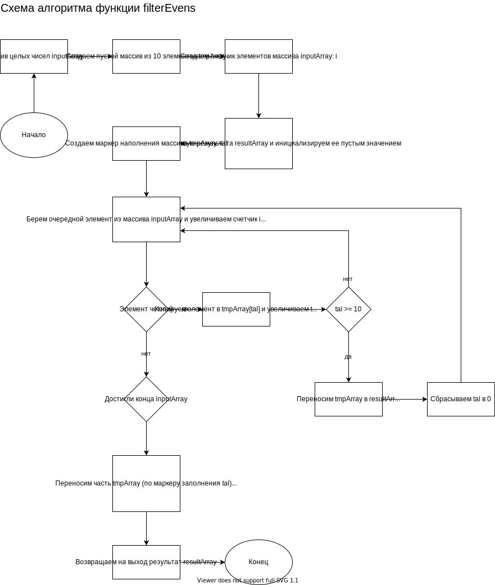

## Итоговая проверочная работа.

### Описание решения

Программа решает задачу фильтрации массива целых чисел по критерию четности.

На вход подается массив целых чисел посредством ввода с клавиатуры. Кроме ручного ввода, предусмотрен тестовый режим с генерацией случайных чисел.

При запуске из консоли программа выводит приглашение с описанием работы.

Предусмотрено несколько команд:
 - Команда 1: начать ввод элементов массива
 - Команда 2: завершить ввод элементов массива и вывести результат
 - Команда 3: очистить массив
 - Команда 4: задать параметры генерации массива случайных чисел и вывести результат
 - Команда 5: выйти из приложения

Алгоритм функции фильтрации реализован при помощи промежуточного массива (ведерка), который накапливает четные числа и сливает результат в общий массив. При такой реализации, получается масштабируемый метод по потреблению памяти. Подобное поведение реализовано в стандартных коллекциях.

### Схема алгоритма функции filterEvens
.

### Код функции filterEvens
```C#
int[] filterEvens(int[] array)
{
    int[] result = { };
    int[] tmpArray = new int[10];
    int tal = 0;

    for (int i = 0; i < array.Length; i++)
    {
        if (array[i] % 2 != 0)
        {
            continue;
        }
        tmpArray[tal++] = array[i];
        if (tal >= tmpArray.Length)
        {
            int oldSize = result.Length;
            Array.Resize(ref result, oldSize + tal);
            Array.ConstrainedCopy(tmpArray, 0, result, oldSize, tal);
            tal = 0;
        }
    }

    if (tal > 0)
    {
        int oldSize = result.Length;
        Array.Resize(ref result, oldSize + tal);
        Array.ConstrainedCopy(tmpArray, 0, result, oldSize, tal);
    }

    return result;
}
```

### Постановка задачи

Данная работа необходима для проверки ваших знаний и навыков по итогу прохождения первого блока обучения на программе разработчик. Мы должны убедиться что базовое знакомство с it прошло успешно.

**Задача:** Написать программу, которая из имеющегося массива целых чисел формирует массив из четных чисел. Первоначальный массив можно ввести с клавиатуры, либо сгенерировать случайным образом. При решении не рекомендуется пользоваться коллекциями, лучше обойтись исключительно массивами.

**Примеры:**
```
[1, 2, 3, 4] -> [2, 4]
[1, 3, 4, 5, 7, 1, 3] -> [4]
[2, -4, 6] -> [2, -4, 6]
[1, 3, 5] -> []
```

**Флоу выполнения:**
1. Создать репозиторий на GitHub.
2. Нарисовать блок-схему алгоритма (можно обойтись блок-схемой основной содержательной части, если вы выделяете ее в отдельный метод).
3. Снабдить репозиторий оформленным текстовым описанием решения (файл README.md).
4. Написать программу, решающую поставленную задачу.
5. Использовать контроль версий в работе над этим небольшим проектом (не должно быть так, что все залито одним комитом, как минимум этапы 2, 3 и 4 должны быть расположены в разных комитах).